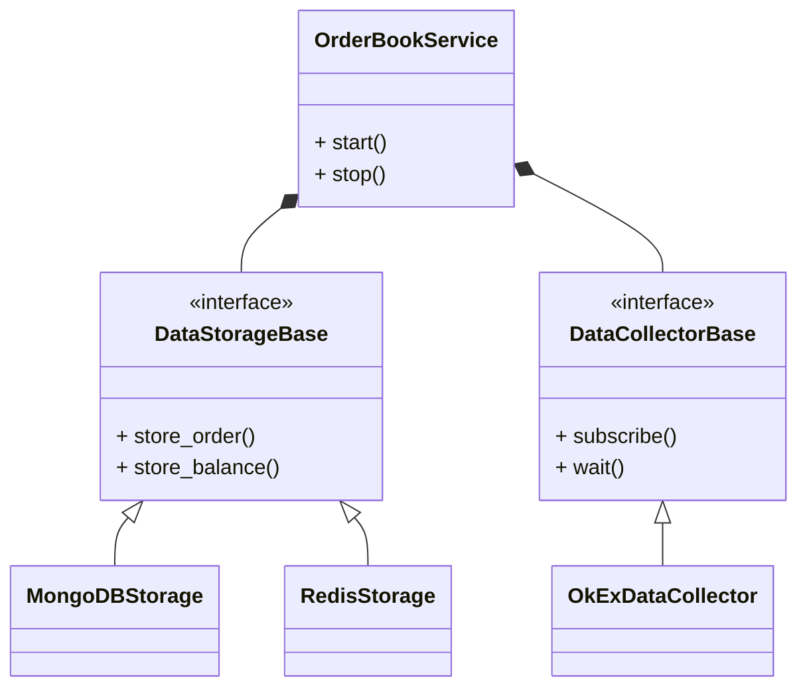

# Target

 Implement a WebSocket-based orderbook data collector for Okex (doc: https://www.okex.com/docs-v5/en/#overview), and update the orderbook, balance, and position data into Redis and MongoDB. Please do the design and unit test for this data collector.

 

Please answer the following questions: 

1. How to keep websocket alive? 

2. How can we achieve better performance with REST API to place order on okex? 


Ans:

1. If there’s a network problem, the system will automatically disable the connection.

   The connection will break automatically if the subscription is not established or data has not been pushed for more than 30 seconds.

   To keep the connection stable:

   1. Set a timer of N seconds whenever a response message is received, where N is less than 30.

   2. If the timer is triggered, which means that no new message is received within N seconds, send the String 'ping'.

   3. Expect a 'pong' as a response. If the response message is not received within N seconds, please raise an error or reconnect.

from: https://www.okex.com/docs-v5/en/?python#websocket-api-connect

2. Compared with rest api, websocket has following advantages

   1. it does not need to be reconnected every time, 
   2. the amount of data is less, 
   3. allowing the server to actively push data
   4. can use asynchronous IO programming to further improve performance


# Design

## class diagram



## OKEx data collector

Use websocket to log in to the simulation interface`wss://wspap.okex.com:8443/ws/v5/private?brokerId=9999`

balance and position data collection：subscribe balance_and_position channel，the channel pushes balance and position data to client. After received the data, we store the data to DB's balance and position table

```json
{
    "arg": {
        "channel": "balance_and_position"
    },
    "data": [{
        "pTime": "1597026383085",
        "eventType": "snapshot",
        "balData": [{
            "ccy": "BTC",
            "cashBal": "1",
            "uTime": "1597026383085"
        }],
        "posData": [{
            "posId": "1111111111",
            "tradeId": "2",
            "instId": "BTC-USD-191018",
            "instType": "FUTURES",
            "mgnMode": "cross",
            "posSide": "long",
            "pos": "10",
            "ccy": "BTC",
            "posCcy": "",
            "avgPx": "3320",
            "uTime": "1597026383085"
        }]
    }]
}
```


order data collection: subscribe to orders channel. we store data to DB's orders table

```json
{
    "arg": {
        "channel": "orders",
        "instType": "FUTURES",
        "uly": "BTC-USD"
    },
    "data": [{
        "instType": "FUTURES",
        "instId": "BTC-USD-200329",
        "ordId": "312269865356374016",
        "clOrdId": "b1",
        "tag": "",
        "px": "999",
        "sz": "3",
        "ordType": "limit",
        "side": "buy",
        "posSide": "long",
        "tdMode": "cross",
        "fillSz": "0",
        "fillPx": "long",
        "tradeId": "0",
        "accFillSz": "323",
        "fillTime": "0",
        "fillFee": "0.0001",
        "fillFeeCcy": "BTC",
        "execType": "T",
        "state": "canceled",
        "avgPx": "0",
        "lever": "20",
        "tpTriggerPx": "0",
        "tpOrdPx": "20",
        "slTriggerPx": "0",
        "slOrdPx": "20",
        "feeCcy": "",
        "fee": "",
        "rebateCcy": "",
        "rebate": "",
        "pnl": "",
        "category": "",
        "uTime": "1597026383085",
        "cTime": "1597026383085",
        "reqId": "",
        "amendResult": "",
        "code": "0",
        "msg": ""
    }, {
        "instType": "FUTURES",
        "instId": "BTC-USD-200829",
        "ordId": "312269865356374016",
        "clOrdId": "b1",
        "tag": "",
        "px": "999",
        "sz": "3",
        "ordType": "limit",
        "side": "buy",
        "posSide": "long",
        "tdMode": "cross",
        "fillSz": "0",
        "fillPx": "long",
        "tradeId": "0",
        "accFillSz": "323",
        "fillTime": "0",
        "fillFee": "0.0001",
        "fillFeeCcy": "BTC",
        "execType": "T",
        "state": "canceled",
        "avgPx": "0",
        "lever": "20",
        "tpTriggerPx": "0",
        "tpOrdPx": "20",
        "slTriggerPx": "0",
        "slOrdPx": "20",
        "feeCcy": "",
        "fee": "",
        "rebateCcy": "",
        "rebate": "",
        "pnl": "",
        "category": "",
        "uTime": "1597026383085",
        "cTime": "1597026383085",
        "reqId": "",
        "amendResult": "",
        "code": "0",
        "msg": ""
    }]
}
```

## MongoDB design

DB name: okex

3 tables(collection)：order, balance, position

table structure:

- order table: Every row (document) contains following keys: instType, instId, ordId, tradeId, cTime. the types are all string
- balance table: Every row (document) contains following keys: ccy, cashBal, uTime. the types are all string
- position table: Every row (document) contains following keys: posId, tradeId, instId, instType, pos, ccy, uTime. the types are all string

## Redis DB design

Redis requires data to be stored in the form of key and value. We need to design the key by ourselves. The key for each data is: prefix + self-incrementing number. Redis has the incr instruction to achieve atomic number self-increment

| data                            | Redis key name       | Redis value format                                      |
| ------------------------------- | -------------------- | ------------------------------------------------------- |
| order (should be Public-Depth5) | `order + <ordernum>` | hash: instType， instId， ordId， tradeId， cTime       |
| balance                         | `balance`            | hash: ccy， cashBal， uTime                             |
| position                        | `position`           | hash: posId, tradeId, instId, instType, pos, ccy, uTime |

# Testing

- Unit Test
  - Implemented unit test for OrderBookService. Okex data collector and DB storage are mocked
- Real Test
  - Communicate with the real system for testing. Need to manually check the results. Automatic testing is not implemented
  - Implemented module test for OKEx, Redis, MongoDB, cpprest sdk

# TODO

- [x] OKEx collecctor: Asynchronously wait for the push data from the websocket server
- [ ] DB: Asynchronously insert data into DB
- [x] OKEx collecctor: Implement ping pong
- [ ] OKEx collecctor & Orderbook::stop: Implement task cancelling by token
- [ ] Error handling
- [ ] Implement position data collector
- [ ] OKEx: How to get the history data if sw is crashed/closed